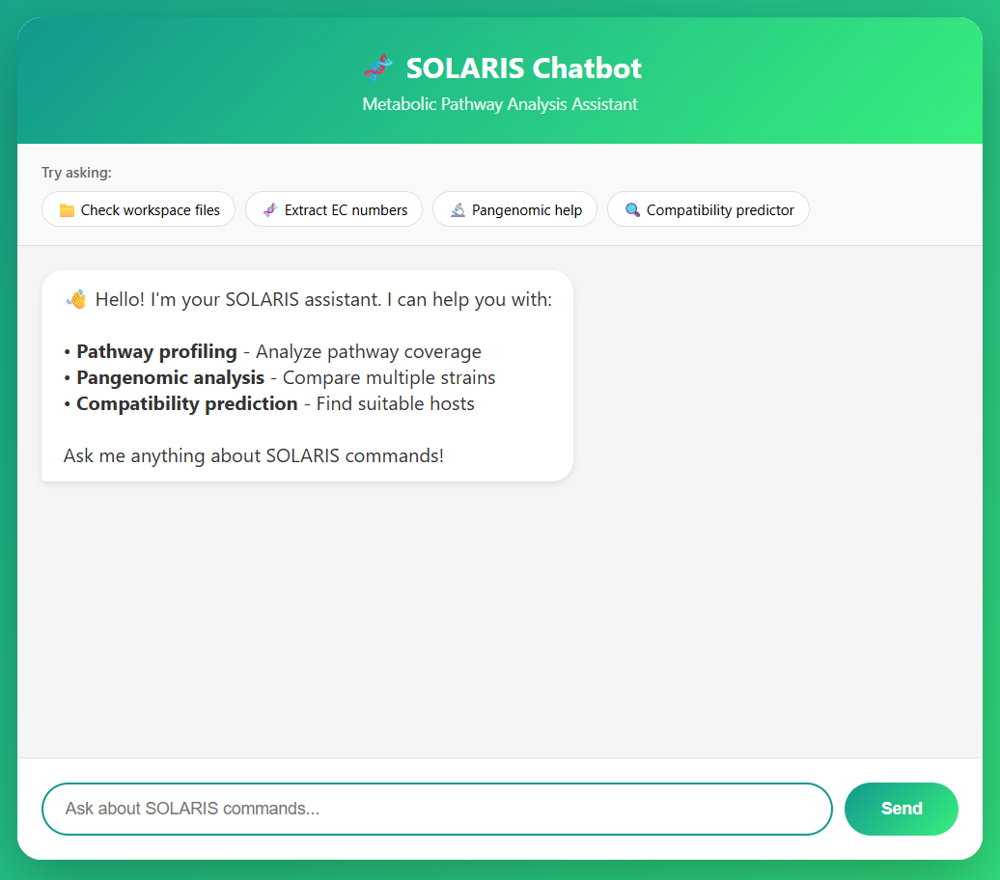

# BIOMERA — the Solaris Chatbot Agent

BIOMERA is a chatbot-style AI agent that runs and orchestrates SOLARIS commands. The public chatbot is available at:

https://solaris-chatbot-wwd4.onrender.com/



Use the chatbot to interact with SOLARIS modules (pathway profiler, pangenomic analyzer, compatibility predictor) using natural language. BIOMERA converts user instructions into planned steps and safely executes Solaris commands inside controlled environments.

This README explains what BIOMERA is, how the repository is organized, how the system works, and how to run it locally or in Docker/Render.

## High level: how BIOMERA works
- Input: a user message (chat) describing a task.
- Planner: an LLM (local via Ollama or remote via API) parses the request and generates an action plan.
- Validator & Safety: commands are validated (required flags, disallowed interactive prompts). The agent will refuse unsafe or interactive execution unless explicitly permitted.
- Executor: validated commands are run inside a controlled executor (local sandbox or Docker executor). Output, logs and any files created are returned to the user.

Key design goals: safety (no hidden interactive prompts), reproducibility (Docker), and explainability (the agent returns both an apology/explanation and the raw terminal output when commands fail).

## Repository structure
Top-level overview (most relevant folders and files):

- `biomera/` — BIOMERA chatbot code and Dockerfile (this folder). Key files:
	- `main.py` — chat loop / agent orchestration and LLM integration.
	- `api.py` — lightweight Flask API used by the web UI.
	- `cli.py` — CLI entrypoint for running the agent locally.
	- `Dockerfile` — Docker image used for Render and production builds (install system deps such as HMMER).
	- `README.md` — this file.

- `model/` — LLM adapter implementations (local and online options).

- `config/` — configuration files (LLM settings, tool definitions, prompts). Important files:
	- `config/config.json` — central BIOMERA configuration (which model to use, executor choices).
	- `config/prompt.txt` — default system prompt for the agent.

- `sandbox/` — sandboxed execution helpers and safety wrappers used when running untrusted commands locally.

- `tests/`, `results/`, `modeling/`, `cyanobacteria_proteomes/` — supporting test data, example outputs and models (not required to run BIOMERA but useful for development and validation).

## How to run

### 1) Quick local (development)

Run inside a Python virtualenv and use the Python entrypoint (development mode):

```bash
python -m venv .venv
source .venv/bin/activate
pip install -e .
pip install -r requirements.txt

# start the chat agent (interactive terminal)
python biomera/main.py
```

Configuration:
- Edit `config/config.json` to select `use_online` or local Ollama model. Set API keys via environment variables for online models.

### 2) Docker (recommended / production)

Docker bundles system tools (HMMER, etc.) that the SOLARIS modules require.

```bash
# build the image
docker build -f biomera/Dockerfile -t solaris-biomera:dev .

# run the container and connect to the chat service
docker run --rm -it -p 5000:5000 solaris-biomera:dev

# quick check inside the container to confirm system tools are present
docker run --rm solaris-biomera:dev bash -lc "which hmmfetch && hmmfetch --version"
```

### 3) Render deploy

This repository includes `render.yaml` to instruct Render to build the Docker image (`biomera/Dockerfile`). Ensure you push the branch configured in `render.yaml` (default: `dev`) and set any needed secrets in the Render dashboard (API keys, credentials).

If Render logs show a Python buildpack instead of Docker, confirm `render.yaml` is present and that the service is configured to use the repo manifest.
